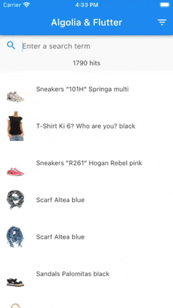

# Algolia & Flutter

The example of basic search experience built with Flutter and Algolia using the [Algolia Helper for Flutter](https://pub.dev/packages/algolia_helper_flutter).
The complete source code of [Getting Started with Flutter tutorial](https://algolia.com/doc/guides/building-search-ui/getting-started/how-to/flutter/ios/) 

Other resources:

- [Algolia Flutter Ecommerce UI Template](/doc/guides/building-search-ui/ecommerce-ui-template/overview/ios/) – showcase of advanced search interface for e-commerce use-case.
